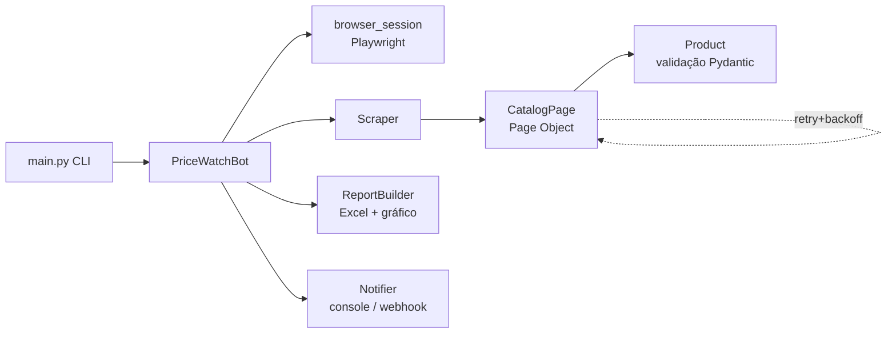

# 🤖 PriceWatch RPA

> Robô de automação (RPA) que monitora preços de produtos em um site, extrai os dados com **Playwright** e gera um **relatório Excel formatado** com KPIs e gráfico — tudo com logging estruturado, retentativas automáticas e testes.

<p>
  
  
  
  
  
  
</p>

---

## ✨ Por que este projeto

Este repositório demonstra um **fluxo de RPA completo e production-ready**, não um script solto:

- 🧱 **Arquitetura limpa** com Page Object Model e separação por camadas (core / pages / models / services).
- ♻️ **Resiliência**: retentativas com *exponential backoff* (Tenacity) e *screenshot* automático em caso de falha.
- 🧾 **Saída de negócio**: planilha `.xlsx` com tabela estilizada, aba de resumo (KPIs) e gráfico de barras.
- 🗄️ **Histórico em SQLite**: cada execução é persistida e comparada com a anterior — o relatório marca quais produtos **subiram (▲)** ou **caíram (▼)**, com Δ e Δ%, numa aba dedicada.
- 📊 **Configuração type-safe** via Pydantic Settings (`.env`).
- 🪵 **Logging estruturado** (console colorido + arquivo JSON rotativo) com Loguru.
- ✅ **Qualidade**: testes com `pytest` + cobertura, lint com `ruff`, CI no GitHub Actions.
- 🐳 **Reprodutível**: roda com um comando via Docker.

> Alvo padrão: `books.toscrape.com`, um sandbox público feito **especificamente para praticar scraping** — sem violar Termos de Uso de nenhum serviço real.

---

## 🏗️ Arquitetura



## 📂 Estrutura

```
rpa-price-monitor/
├── config/settings.py          # configuração type-safe (Pydantic)
├── src/pricewatch/
│   ├── main.py                 # entrypoint CLI
│   ├── bot.py                  # orquestra o processo de ponta a ponta
│   ├── core/                   # browser, logger, retry, utils
│   ├── pages/                  # Page Object Model
│   ├── models/                 # Product + ProductDelta (domínio + validação)
│   └── services/               # scraper, history (SQLite), report (Excel), notifier
├── data/                       # histórico SQLite (history.db, gerado em runtime)
├── tests/                      # pytest (rodam offline)
├── .github/workflows/ci.yml    # lint + testes automáticos
├── Dockerfile / docker-compose.yml
└── output/sample_report.xlsx   # exemplo do relatório gerado
```

---

## 🚀 Como rodar

### Opção A — local (venv)

```bash
python -m venv .venv && source .venv/bin/activate   # Windows: .venv\Scripts\activate
pip install -r requirements.txt
playwright install chromium

cp .env.example .env            # opcional: ajuste as variáveis

# roda o robô (5 páginas, headless)
PYTHONPATH=src:. python -m pricewatch.main --pages 5

# para assistir o navegador trabalhando:
PYTHONPATH=src:. python -m pricewatch.main --pages 3 --headed
```

O relatório aparece em `output/price_report_<timestamp>.xlsx`.

### Opção B — Docker

```bash
docker compose up --build
```

---

## ⚙️ Configuração (`.env`)

| Variável      | Padrão                        | Descrição                                   |
|---------------|-------------------------------|---------------------------------------------|
| `BASE_URL`    | `https://books.toscrape.com`  | Site-alvo                                   |
| `MAX_PAGES`   | `5`                           | Quantas páginas do catálogo percorrer       |
| `HEADLESS`    | `true`                        | Rodar sem janela do navegador               |
| `MAX_RETRIES` | `3`                           | Tentativas em falhas transitórias           |
| `WEBHOOK_URL` | *(vazio)*                     | Webhook Slack/Teams p/ resumo da execução   |

---

## 🧪 Qualidade

```bash
ruff check .     # lint
pytest           # testes + cobertura
```

Os testes não dependem de rede: validam parsing de preço/rating, o modelo `Product` e a geração do Excel.

---

## 🗺️ Roadmap

- [x] Persistir histórico em SQLite e detectar variações de preço entre execuções
- [ ] Agendamento (cron / GitHub Actions schedule)
- [ ] Dashboard simples (Streamlit) sobre os relatórios

## 📝 Licença

MIT — veja [LICENSE](LICENSE).
